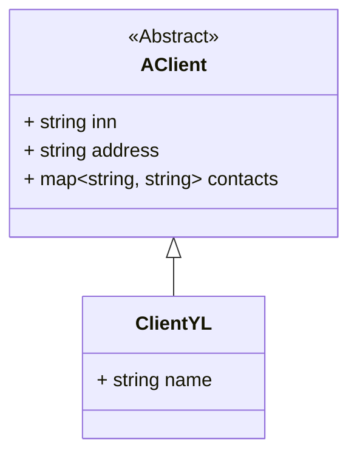
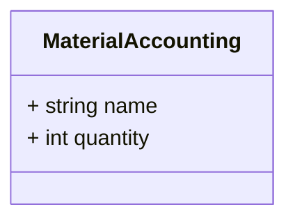
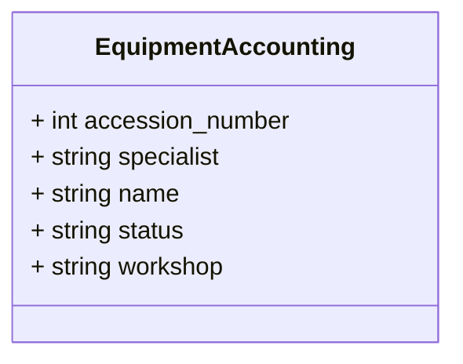

## Учет клиентов


## Учет материалов



## Учет оборудования


## Учет сотрудников

```mermaid
classDiagram
    class EmployeeAccounting{
        + string full_name
        + string speciality
        + string status
        + string employee_number
    }