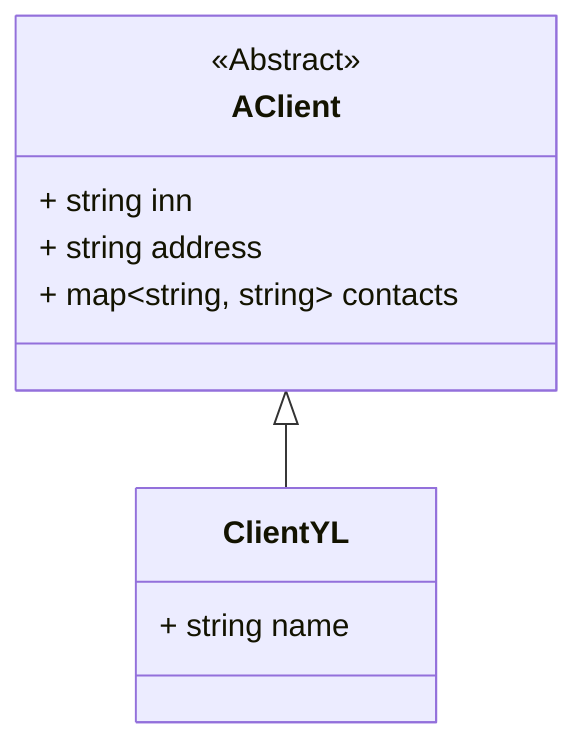

`Client`

```mermaid
classDiagram
    class AClient {
        <<Abstract>>

        + string inn
        + string address
        + map~string, string~ contacts
    }

    AClient <|-- ClientYL
    class ClientYL {
        + string name
    }
```