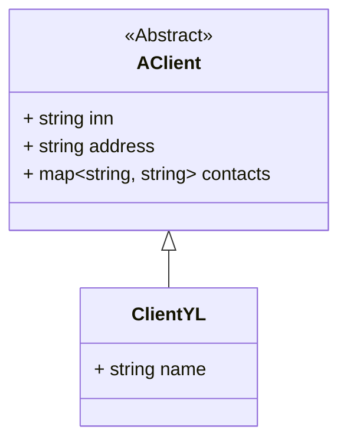
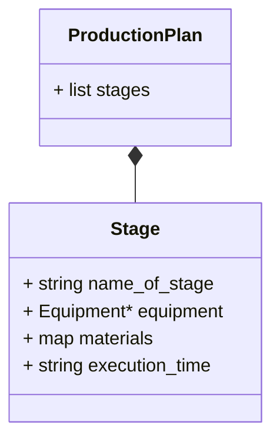
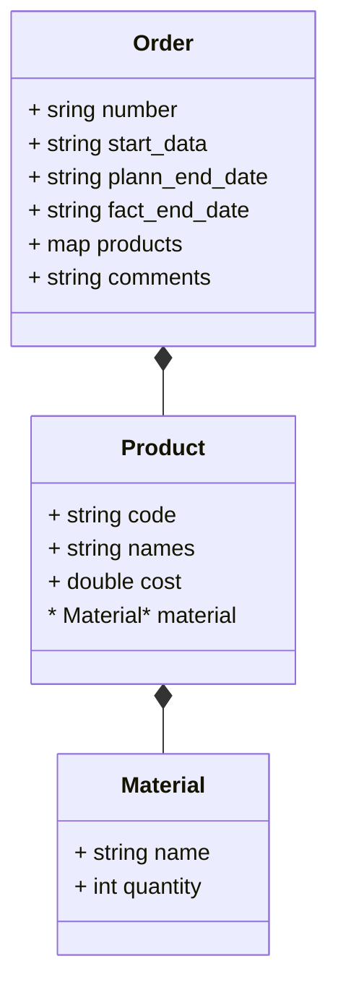
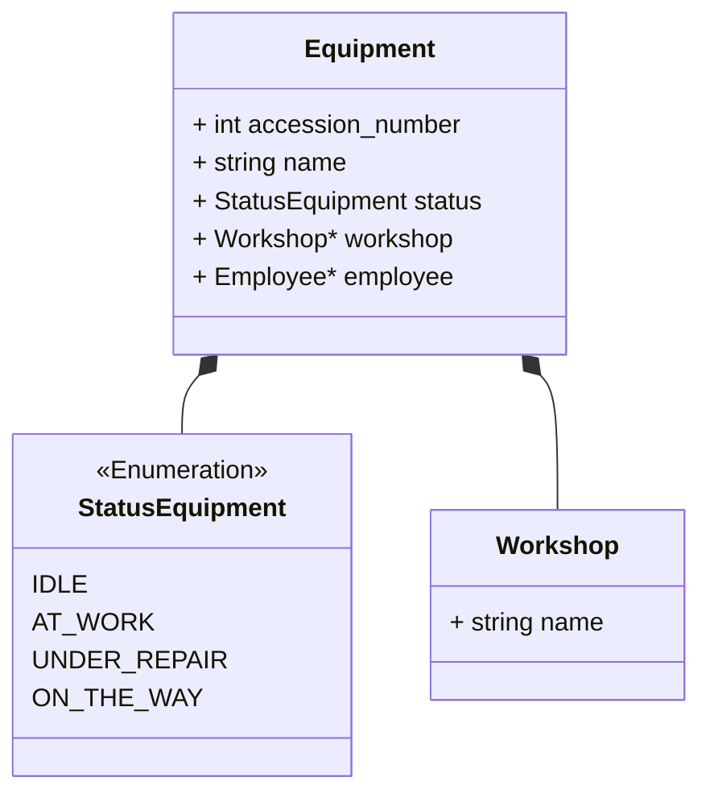
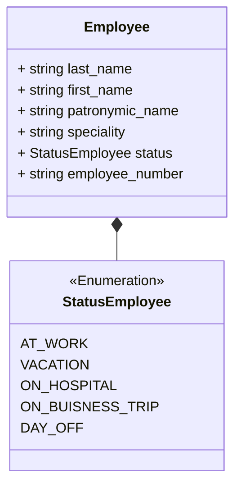

## Учет клиентов

```mermaid
classDiagram
    class AClient {
        <<Abstract>>

        + string inn
        + string address
        + map~string, string~ contacts
    }

    AClient <|-- ClientYL
    class ClientYL {
        + string name
    }
```
## Учет этапов производства

```mermaid
classDiagram
    class Stage {
        + string name_of_stage
        + Equipment* equipment
        + map<Material*, int> materials
        + string execution_time
    }

    ProductionPlan *-- Stage
    class ProductionPlan {
        + list<Stage*> stages
    }
```
## Учет заказов

```mermaid
classDiagram
    Order *-- Product
    class Order {
        + sring number
        + string start_data
        + string plann_end_date
        + string fact_end_date
        + map<Product*, int> products
        + string comments
    }

    class Product {
       + string code
       + string names
       + double cost
       * Material* material
    } 

    Product *-- Material
    class Material {
        + string name
        + int quantity
    }
```

## Учет оборудования

```mermaid
classDiagram
    class StatusEquipment {
        <<Enumeration>>
        IDLE
        AT_WORK
        UNDER_REPAIR
        ON_THE_WAY
    }

    Equipment *-- StatusEquipment
    Equipment *-- Workshop
    class Equipment {
        + int accession_number
        + string name
        + StatusEquipment status
        + Workshop* workshop
        + Employee* employee
    }

    class Workshop {
        + string name
    }
```
## Учет сотрудников

```mermaid
classDiagram
    class StatusEmployee {
        <<Enumeration>>
        AT_WORK
        VACATION
        ON_HOSPITAL
        ON_BUISNESS_TRIP
        DAY_OFF
    }

    Employee *-- StatusEmployee
    class Employee{
        + string last_name
        + string first_name
        + string patronymic_name
        + string speciality
        + StatusEmployee status
        + string employee_number
    }
```