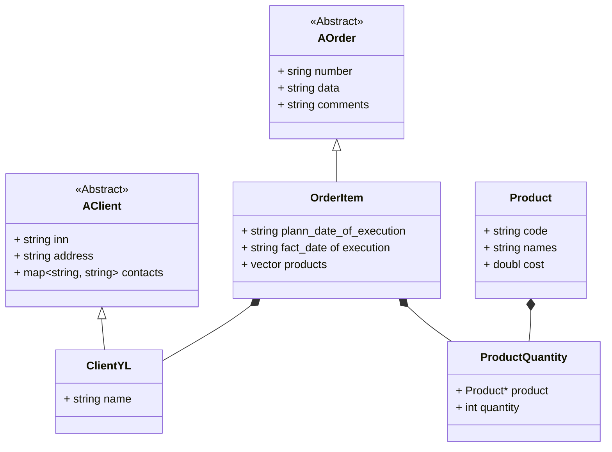

`AccountingForOrders`

`ProductionOfProducts`
```mermaid
classDiagram
    class AStage {
        <<Abstract>>

        + string name
        + string time
    }

    AStage <|-- StageItem
    class StageItem {
        + string equipment
        + vector<pair<string, int>> materials
    }

    ProductionPlan *-- StageItem
    class ProductionPlan {
        + map<string, StageItem*> stages
    }
